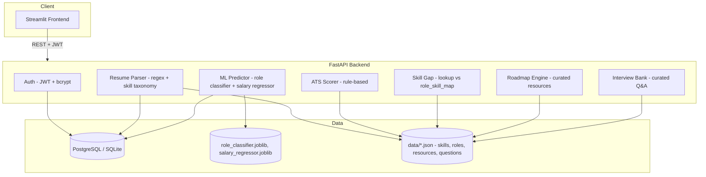

# Architecture

This documents what was actually built through Phases 1-6 — including
where reality diverged from the original Phase 1 plan, and why.

## Tech stack (as built)

| Layer | Choice | Note |
|---|---|---|
| Backend | FastAPI | as planned |
| Database | PostgreSQL (prod/Docker), SQLite (local dev) | as planned |
| Migrations | Alembic | added in Phase 5, not Phase 2 — deliberately deferred until the schema stabilized |
| Frontend | Streamlit (multi-page) | as planned |
| Role classifier | **Logistic Regression** (winner) | Phase 1 assumed a tree ensemble would win; the actual comparison (Phase 3) showed Logistic Regression edged out Random Forest and XGBoost on macro-F1 — a good reminder to always run the comparison rather than assume |
| Salary regressor | XGBoost (winner) | as expected — non-linear relationship favors gradient boosting |
| Password hashing | `bcrypt` directly | Phase 1 assumed `passlib` (the common tutorial choice); switched after hitting a real passlib/bcrypt 4.1+ incompatibility in Phase 2 |
| JSON columns | Generic `JSON`, with `.with_variant(JSONB, "postgresql")` | Phase 2 originally claimed this became JSONB "automatically" on Postgres — checked against a real Postgres instance in Phase 5 and found that was wrong; fixed explicitly |

## System diagram



## Why only 2 of 9 features are ML

A running theme across this project (see the conversation in Phase 1-2): a
feature needs a trained model only when the input→output relationship
genuinely can't be hand-written as a rule. Only **role prediction** and
**salary prediction** meet that bar here — the mapping from skills to job
role, and from experience/skills/location to salary, is too high-dimensional
and fuzzy to encode as `if/else`. Everything else (ATS scoring, skill gap,
roadmap, interview questions, resume parsing) is deterministic rule-based
or lookup logic, which is both simpler and more explainable — worth being
able to articulate clearly in an interview rather than claiming "the whole
app uses AI."

## Database schema

See `docs/er_diagram.md` for the full ER diagram. Summary: `users` →
`resumes` (1:many) → `ats_scores` and `predictions` (1:1 each, via unique
`resume_id` foreign key). JSON/JSONB columns hold variable-shaped data
(`extracted_data`, `category_scores`, `suggestions`, `role_probabilities`)
rather than exploding into many small join tables.

## Folder structure (final)

```
ai-career-intelligence/
├── backend/            # FastAPI app, Alembic migrations, tests, Docker
│   ├── app/
│   ├── alembic/
│   ├── tests/
│   ├── ml_models/       # copied .joblib artifacts (see note below)
│   └── Dockerfile, entrypoint.sh
├── frontend/            # Streamlit multi-page app, Docker
│   ├── pages/, components/, assets/
│   └── Dockerfile
├── ml/                  # training pipeline (separate from backend deployable)
│   ├── training/, evaluation/, datasets/, artifacts/, tests/
├── data/                # shared JSON: skills taxonomy, role-skill map,
│                        # skill resources, interview questions
├── docs/                # this documentation
├── .github/workflows/   # CI
└── docker-compose.yml
```

**Note on `backend/app/ml_models/`**: the trained model artifacts are
copied into the backend at build time rather than the backend importing
from `ml/` directly. This mirrors real deployments, where the training
pipeline and the serving API are separate deployables — retraining only
means re-copying the `.joblib` files, not shipping the training code to
production.

## ATS scoring rubric (rule-based, not ML)

| Category | Max points | Logic |
|---|---|---|
| Keywords/skills | 30 | scaled by count of recognized skills found (8+ = full marks) |
| Sections present | 25 | checks for Skills/Education/Experience-or-Projects/Certifications keywords |
| Action verbs | 20 | scaled by count of verbs like "built", "led", "optimized" found |
| Formatting/length | 15 | word count in a reasonable range (250-900 words) |
| Contact info | 10 | email (5) + phone (5) detected |

## Known limitations (carried forward honestly from earlier phases)
- Resume parser can't estimate years of experience or infer location/company type — the prediction endpoint asks the user directly instead of guessing (a wrong guess would silently corrupt both models' outputs)
- Interview questions and skill resources are curated for common skills/roles with a generic fallback template for the rest — not exhaustive
- No live LLM-backed chatbot (deferred bonus feature, would need an external API key)
