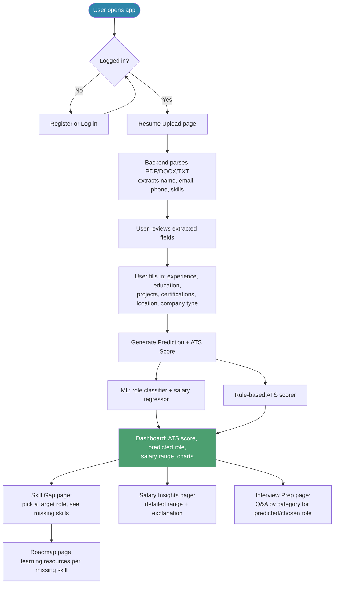

# User Flowchart

## Notes
- Dashboard depends on having uploaded a resume and generated at least one prediction — the frontend's page ordering (`1_Resume_Upload` before `2_Dashboard`) reflects this dependency, adjusted from the Phase 1 plan's listed order for better UX.
- Skill Gap, Roadmap, and Interview Prep can each be revisited with a *different* target role than the one predicted — the prediction suggests a role, it doesn't lock the user into it.
